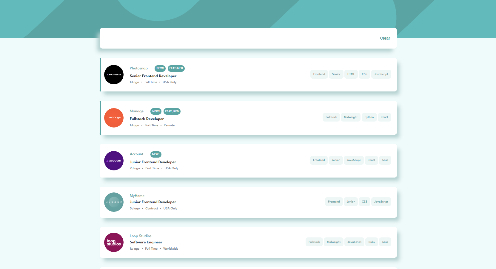
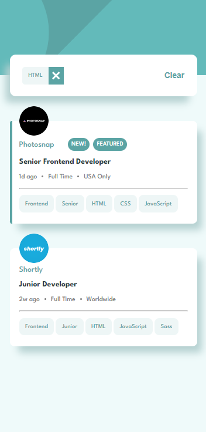

# JobListing

This project was generated with [Angular CLI](https://github.com/angular/angular-cli) version 15.2.0.

### Challenge from [Frontend Mentor](https://www.frontendmentor.io/challenges/job-listings-with-filtering-ivstIPCt)

Users are able to filter job offers by selecting tags.

### Live demo [here](https://magical-tanuki-96d393.netlify.app)

### Screenshots

